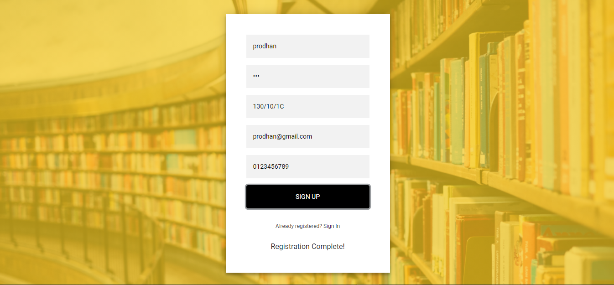
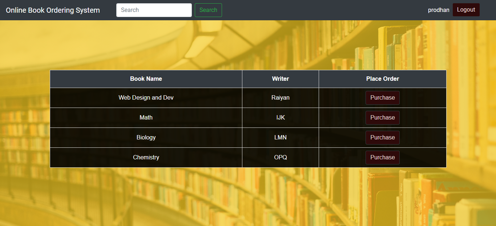
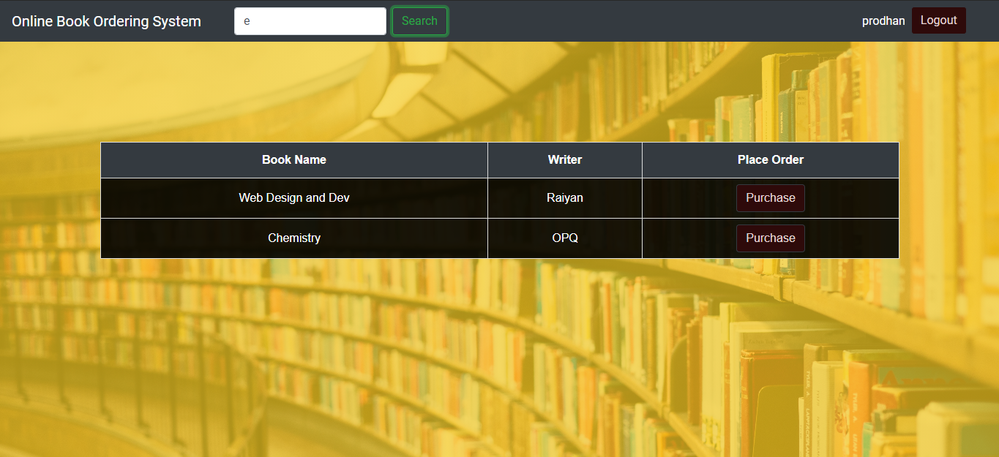
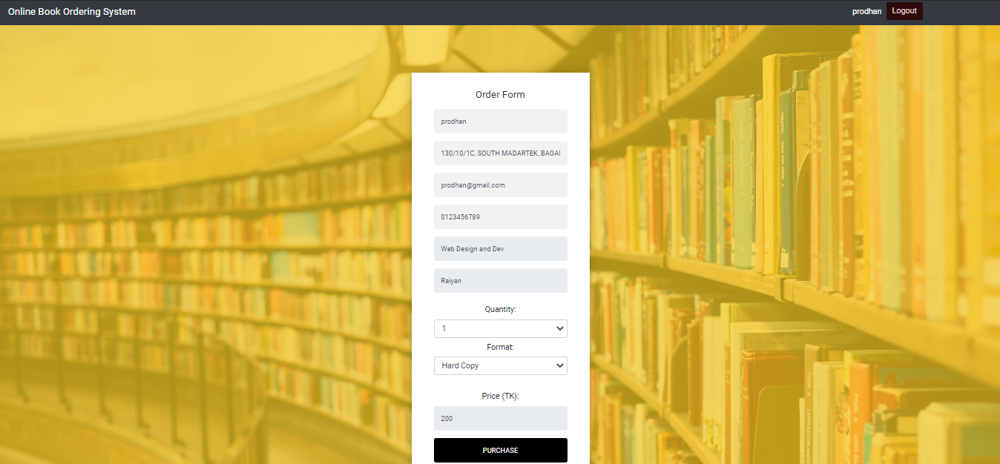
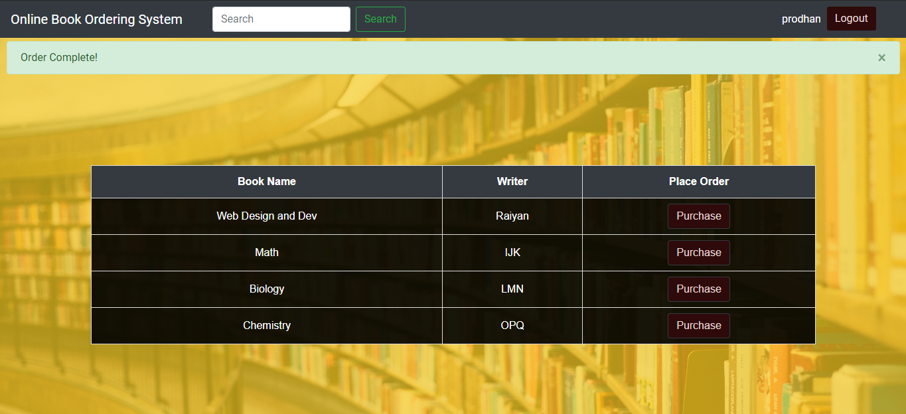

# Online Book Ordering System
A simple book ordering system with user registration, login, book search and purchase option

### How to run the web app
1. Download or clone the repository
2. From the main folder type and execute from console "npm install"
3. Run the index.js from the main folder using "node index.js" command
4. Open home.html from the public folder into a web browser
5. Done!

### Languages, Frameworks and Softwares Used
HTML, CSS, Bootstrap, Javascript, Node.js, Express, REST API 
Visual Studio, Postman

### Features
This project was built using arrays and objects as database, so no data after closing the tab will be stored. 
To use this web app, one will have to create an account first, and then use it. Main features of this web app:
* Signup
* Sign in
* Book list
* Search bar for searching books
* Purchase option

### Screenshots of the web app
#### Login Page

#### Registration Page

#### Home Page

#### Search Option

#### Purchase Option

#### Order Complete Alert

